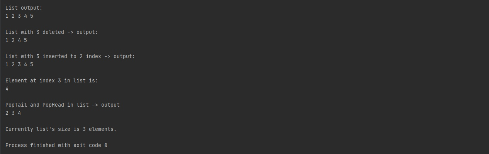

# Программа реализует структуру данных - двусвявзный список. Язык реализации - Java.
## Выполнил студент БПИ199 Кочарян Тигран Самвелович <tskocharyan@edu.hse.ru>.
---

## Структура проекта:

* Интерфейс IDoubleListable - определяет методы, которые реализует класс двусвязного списка.

* Клас Node - экземпляр данного класса хранит ссылку на предыдущую и текущую Node'у, а также значение внутри Node'ы.

* Класс DoubleLinkedList - реализуется интерфейс IDoubleListable с использованием Node в качестве head (голова, начало) и tail (хвост, конец).
---

## Описание работы программы:

* Список позволяет добавлять:
  + в конец
  + в начало
  + вставлять в любой индекс <= size и >= 0 

* Список позволяет удалять: 
  + конец
  + начало
  + по конкретному значению 
  + полное удаление списка

* Список может вернуть:
  + свой размер
  + значение по конкретному индексу < size и >= 0
  
* Метод Contains(T element) возвращает:
  + true - если в списке присутствует element
  + false - если его там нет

---
## Примеры работы кода:

#### Скриншот 1. Вывод в консоль проверки корректности работы программы.

---
## [Контакты.](https://vk.com/k_tigran)
